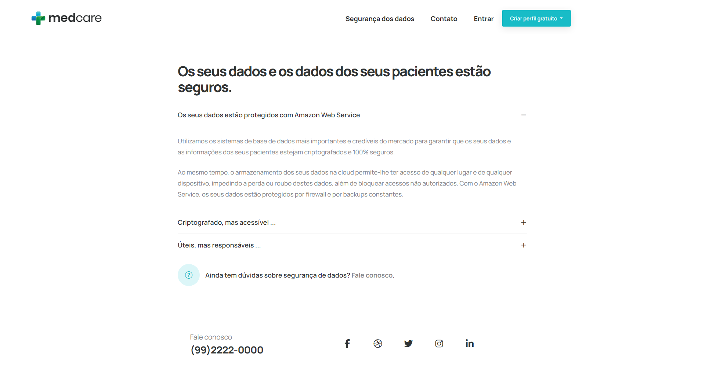

<h1 align="center">
    
</h1>


<p align="center">
 <a href="#sobre-o-projeto">Sobre</a> •
 <a href="#funcionalidades">Funcionalidades</a> •
 <a href="#layout">Layout</a> •
 <a href="#como-executar-o-projeto">Como executar</a> • 
 <a href="#tecnologias">Tecnologias</a> •  
 <a href="#protótipo-figma">Protótipo (Figma)</a> •  
 <a href="#autor">Autor</a> • 
 <a href="#licença">Licença</a>
</p>


<h4 align="center"> 
	Em desenvolvimento
</h4>

## Sobre o projeto

O projeto tem como finalidade centralizar informações sobre médicos. Permitindo o cadastro de médicos, horários de atendimemto e pacientes. Busque os médicos cadastrados por nome/localidade, verifique os horários de atendimento e marque a consulta. 

Projeto desenvolvido para atender ao MVP da disciplina de Front End Avançado (PUC-RIO).


## Funcionalidades

- [x] Busca por médicos: 
  - [x] listar médicos buscando por nome
  - [x] listar médicos buscando por cidade
  - [x] listar médicos buscando por especialidade
- [x] Cadastro de médicos: 
  - [ ] cadastrar horários de atendimento
  - [ ] cadastrar perfil
    - [ ] receber e-mail para ativação da conta
    - [ ] receber SMS/Whatsapp para confirmação do celular
  - [x] listar médicos buscando por cidade
  - [x] listar médicos buscando por especialidade
- [ ] Cadastro de usuários/pacientes: 
  - [ ] receber e-mail para ativação da conta
  - [ ] receber SMS/Whatsapp para confirmação do celular


## Layout

<div align="center">
    
    
</div>

<div align="center">
    
    <!--  -->
</div>


## Pré-requisitos

Certifique-se de ter o [Nodejs, ou o npm,](https://nodejs.org/en/download/) instalado. 


## Como executar o projeto


Será necessário ter todas as libs python listadas no `requirements.txt` instaladas.
Após clonar o repositório, é necessário ir ao diretório raiz, pelo terminal, para poder executar os comandos descritos abaixo.

> É fortemente indicado o uso de ambientes virtuais do tipo [virtualenv](https://virtualenv.pypa.io/en/latest/installation.html).

```
(env)$ pip install -r requirements.txt
```

Este comando instala as dependências/bibliotecas, descritas no arquivo `requirements.txt`.


#### Executando o servidor


Para executar:

```
(env)$ python manage.py runserver 
```


#### Acesso no browser (Web)
Abra o [http://localhost:8000](http://localhost:8000) no navegador para visualizar.


#### Acesso no browser (API)
Abra o [http://localhost:8000/api/v1/swagger/](http://localhost:8000/api/v1/swagger/) no navegador para verificar o status da API em execução.


##  Tecnologias

As seguintes ferramentas foram usadas na construção do projeto:

#### **Web**
[](https://skillicons.dev)

#### **API**
[](https://skillicons.dev)

#### **Utilitários**

[](https://skillicons.dev)

## Autor

 
 <br />
 <sub><b>Léo Aguiar</b></sub></a> 
 <br /><br />


[](mailto:leorodriguesaguiar@gmail.com)


## Licença

Este projeto esta sobe a licença [MIT](./LICENSE).

Feito por Léo Aguiar [Entre em contato!](mailto:leorodriguesaguiar@gmail.com)
